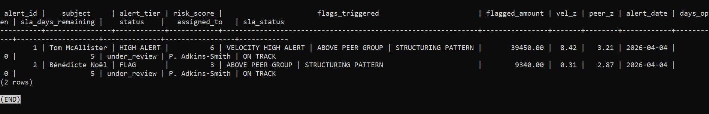
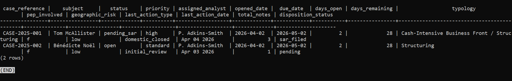
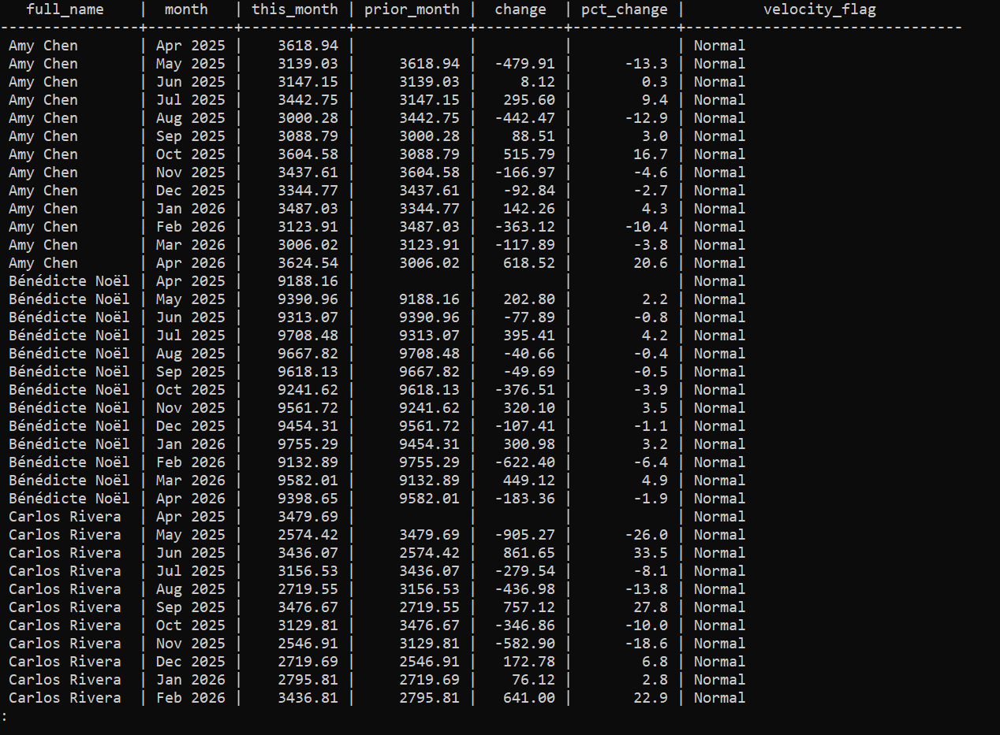
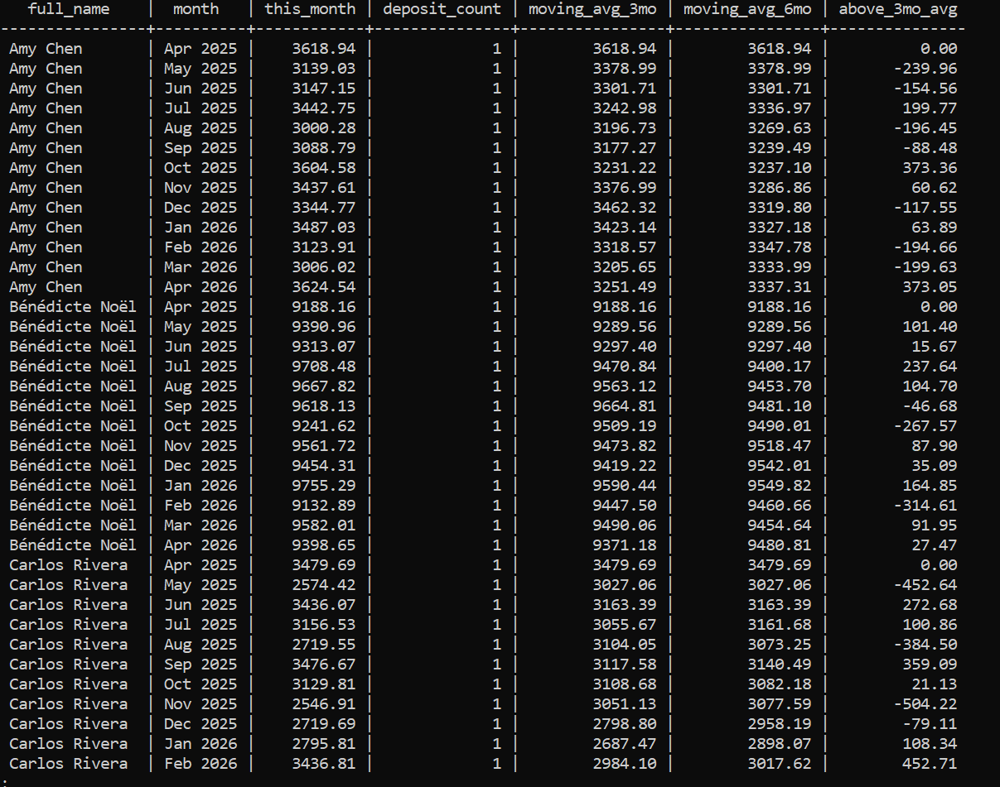

# AML Alert Engine

**Pam Adkins-Smith**
Financial Services Analyst | Transitioning into AML and Financial Crimes Analysis

[LinkedIn](https://linkedin.com/in/pam-adkins-smith) |
[GitHub](https://github.com/padkinssmith)

---

## Background

Twenty years as an analyst. Six years in financial services at E*TRADE,
Morgan Stanley, and Osaic — all regulated institutions with active AML
compliance programs.

My investigative work is real and documented across my career.

At Comcast I spent years in real-time analysis and forecasting — identifying
data anomalies and control gaps, building automated validation checks,
maintaining audit-ready documentation supporting internal compliance reviews,
and managing a database tracking errors across billing and sales activity.
That work required the same pattern recognition, anomaly detection, and
structured documentation that AML investigation demands.

At Red Ventures I identified a coordinated internal fraud scheme involving
19 individuals — time theft and commission fraud — while conducting
performance monitoring. I escalated it through the appropriate channels
and the investigation resulted in terminations. That is not a course.
That is not a portfolio project. That happened.

At E*TRADE, Morgan Stanley, and Osaic I worked directly inside regulated
financial institutions supporting compliance-adjacent workflows, flagging
activity requiring further review, and escalating through established
compliance channels.

I am now transitioning into AML and financial crimes analysis. I built
this project because I wanted to understand how transaction monitoring
actually works before sitting down to use it on the job — not just what
the alerts mean, but why they fire, what regulation requires them, and
what an analyst should be looking for when one does.

---

## What This System Does

It watches bank accounts for suspicious activity.

When something looks wrong it scores the account, generates an alert,
and tracks that alert through the full investigation process — from
the first flag all the way through to the final decision.

Each pattern below is a real detection method built into this system.
The screenshot below each one is actual output from running it.

---

**A customer whose deposits suddenly spike far above their own history**

The system calculates a z-score comparing this month's deposits to the
prior 12-month average. A score above 3.0 triggers a HIGH ALERT.


---

**A business depositing far more than any similar business in the area**

The system compares each account to all other accounts of the same
business type. A flower shop is compared to flower shops, not
restaurants. This catches accounts that are always high, not just
accounts that spike.


---

**Deposits made just under the $10,000 reporting limit, month after month**

The system counts deposits in the $8,000 to $9,999 zone. Three or more
in a single month is a HIGH ALERT. The same pattern is also checked
within any rolling 7-day window to catch aggressive structuring.


---

**The same account using different bank branches to make deposits**

The system counts how many distinct branches an account used in a single
month. Using two or more branches is a documented structuring method.


---

**Cash deposited then quickly withdrawn a few days later**

The system finds any deposit of $5,000 or more followed by a withdrawal
of at least 50% of that amount within 5 days. This is a layering pattern.


---

**An account that sat dormant for months then suddenly became active**

The system identifies accounts with no transactions for 90 or more days
that then receive deposits in the current month.


---

**Transactions connected to countries flagged as high risk**

The system checks all wire transfers against a list of FATF high-risk
country codes and flags any match with a recommended action.


---

When multiple patterns fire on the same account at the same time,
the system combines them into a single risk score and surfaces that
account at the top of the alert queue.

---

## What Happens After the Alert Fires

Detection is only the first part of the job. This system also tracks
everything that comes after.

When an alert fires it is saved and assigned to an analyst. The analyst
opens an investigation, writes notes as they work through each source,
and records how their working theory changes as new evidence comes in.
At the end they record a final decision: clear it, monitor it, refer it,
or file a Suspicious Activity Report with FinCEN.

Every action taken is logged with a timestamp. The full history of every
case is preserved. Nothing disappears.


---

## How to Run It

**What you need:** PostgreSQL 13 or higher installed on your machine
or a server.

**What it does when you run it:** It sets up the database, loads sample
accounts with suspicious patterns already built in, runs all 13 detection
methods, produces the combined alert queue, and then runs the full case
lifecycle layer showing investigations, dispositions, and audit logs.
The whole thing runs in sequence automatically.

**The one command that does everything:**

```bash
sudo -u postgres createdb aml_alert_engine
sudo -u postgres psql -d aml_alert_engine -f run_all.sql
```

**What to look for in the output:**

When the detection engine runs you will see each of the 13 methods
print results to the screen in sequence. When the alert dashboard runs
you will see one row per account sorted by risk score. Tom McAllister
should appear at the top with HIGH ALERT and a risk score of 9.
Robert Kline should appear second with HIGH ALERT from dormant
activation. All other accounts should show NORMAL or WATCH.

If you see that, everything is working correctly.

---

## All Screenshots

All screenshots are unedited output from running this system.

**01 — Combined Alert Dashboard**
All 12 accounts with risk scores and flags. McAllister HIGH ALERT score 9. Kline HIGH ALERT dormant activation. All others NORMAL or WATCH.


---

**02 — Velocity Z-Score Detection**
Current month deposits compared to the 12-month baseline. McAllister z-score 316.97.


---

**03 — Structuring Detection**
McAllister 4 deposits in the structuring zone, HIGH ALERT. Restaurant accounts show single WATCH deposits.


---

**04 — Multi-Branch Detection**
McAllister used Airport Road Branch, Main Street Branch, and Riverside Branch all in one month.


---

**05 — Withdrawal After Deposit**
Three instances of cash deposited then withdrawn within 2 days on the McAllister account.


---

**06 — Geographic Risk Detection**
Wire to Netherlands entity flagged with recommendation to verify business purpose and check OFAC SDN list.


---

**07 — Alert Queue With SLA Tracking**
Both open alerts assigned to P. Adkins-Smith with days remaining before deadline.



---

**08 — Case Status Dashboard**
CASE-2025-001 pending SAR, CASE-2025-002 open. Supervisor view of all open work.



---

**09 — SAR Filing Disposition**
CASE-2025-001 closed. Income gap of $1,256,000 documented. SAR filed with FinCEN. Approved by J. Williams.


---

**10 — Complete Case Audit Trail**
Every action on CASE-2025-001 from alert assignment through SAR filing, timestamped and logged.


---

**11 — Velocity Change Detection**
Month over month change for all accounts. Confirms normal accounts do not trigger false alerts.



---

**12 — Moving Average Trend**
Three-month and six-month smoothed baselines per account showing underlying deposit trends.



---

## What Is in the Repository

```
run_all.sql              — runs the entire system in one command
01_schema.sql            — the database structure
02_sample_data.sql       — sample accounts with patterns built in
03_detection_engine.sql  — 13 detection methods
04_alert_dashboard.sql   — combined alert queue output
05_case_lifecycle.sql    — alert tracking, cases, and dispositions
screenshots/             — actual output from running the system
```

---

## What This Says About Me as a Candidate

Building this system meant making decisions that required real
understanding. Why is the structuring detection zone set at $8,000
and not $9,000? Why does comparing an account to similar businesses
catch things that comparing it to its own history misses? Why does the
audit log need a seven-year retention period and what regulation
requires it?

Every one of those decisions is documented in the code with its
regulatory basis.

I bring twenty years of analytical experience, six years inside
regulated financial institutions, real fraud investigation work, and
the pattern recognition skills built across a career of identifying
anomalies before they become problems. This project is the technical
foundation I built on top of that.

---

## Author

**Pam Adkins-Smith**
Financial Services Analyst | Transitioning into AML and Financial Crimes Analysis
20 years analytical experience | 6 years financial services
E*TRADE | Morgan Stanley | Osaic

[LinkedIn](https://linkedin.com/in/pam-adkins-smith) |
[GitHub](https://github.com/padkinssmith)

Open to AML Analyst, BSA Analyst, Financial Crimes Analyst, and
Compliance Analyst roles. Remote preferred.
