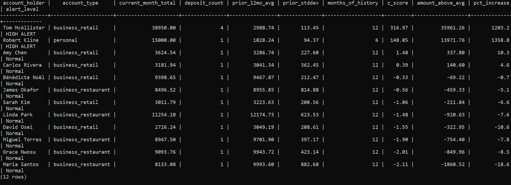
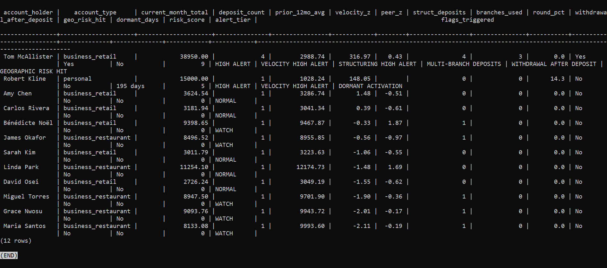
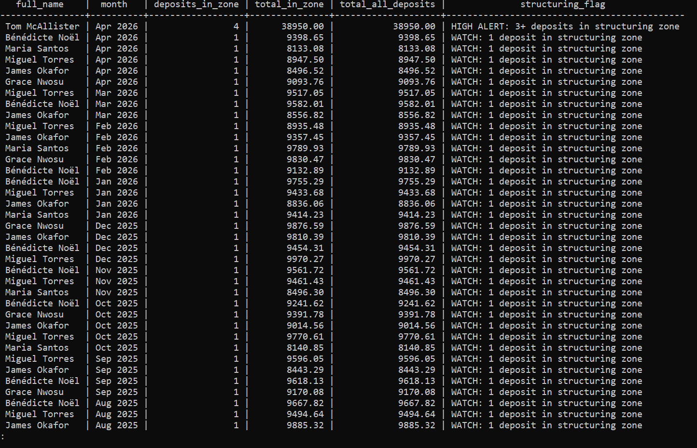
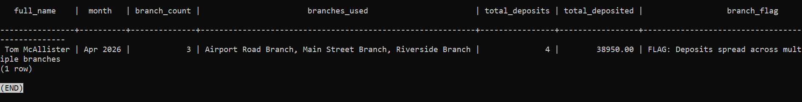
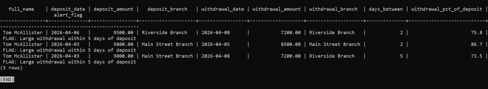
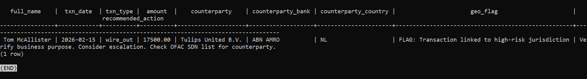
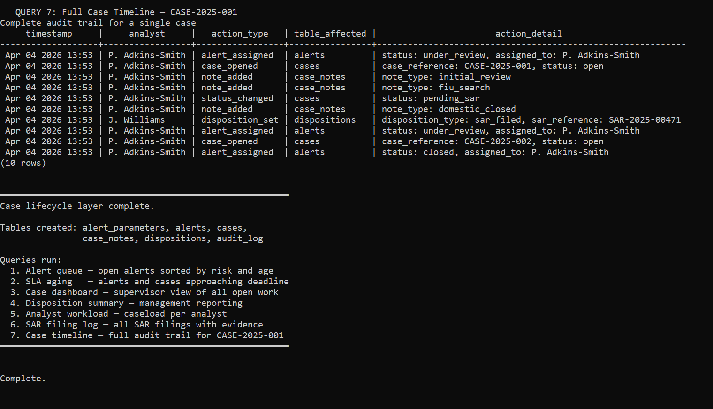
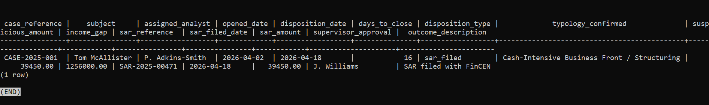

# AML Alert Engine

**Pam Adkins-Smith**  
Financial Services Analyst | Transitioning into AML and Financial Crimes Analysis

[LinkedIn](https://www.linkedin.com/in/pam-adkins-smith) | [GitHub](https://github.com/padkinssmith/aml-alert-engine)

-----

## Background

I am an analyst. I have spent 20 years finding patterns in data and
following them wherever they take me — including fraud investigations,
compliance escalations, and transaction review inside regulated financial
institutions.

I built this project because I wanted to understand how transaction
monitoring works before I use it on the job. Not just what alerts mean —
but why they fire and what an analyst should do when one lands in their
queue.

Full work history: [LinkedIn](https://www.linkedin.com/in/pamadkinssmith)

-----

## What This System Does

It watches bank accounts for suspicious activity.

When something looks wrong it scores the account, generates an alert,
and tracks that alert through the full investigation process — from the
first flag all the way through to the final decision.

Each pattern below is a real detection method built into this system.
The screenshot below each one is actual output from running it.

**A customer whose deposits suddenly spike far above their own history**

The system calculates a z-score comparing this month’s deposits to the
prior 12-month average. A score above 3.0 triggers a HIGH ALERT.



**A business depositing far more than any similar business in the area**

The system compares each account to all other accounts of the same
business type. A flower shop is compared to flower shops, not
restaurants. This catches accounts that are always high, not just
accounts that spike.



**Deposits made just under the $10,000 reporting limit, month after month**

The system counts deposits in the $8,000 to $9,999 zone. Three or more
in a single month is a HIGH ALERT. The same pattern is also checked
within any rolling 7-day window to catch aggressive structuring.



**The same account using different bank branches to make deposits**

The system counts how many distinct branches an account used in a single
month. Using two or more branches is a documented structuring method.



**Cash deposited then quickly withdrawn a few days later**

The system finds any deposit of $5,000 or more followed by a withdrawal
of at least 50% of that amount within 5 days. This is a layering pattern.



**An account that sat dormant for months then suddenly became active**

The system identifies accounts with no transactions for 90 or more days
that then receive deposits in the current month.


**Transactions connected to countries flagged as high risk**

The system checks all wire transfers against a list of FATF high-risk
country codes and flags any match with a recommended action.



When multiple patterns fire on the same account at the same time, the
system combines them into a single risk score and surfaces that account
at the top of the alert queue.

-----

## Skills Demonstrated

|Skill                  |Where Applied                                                                                                                                                                                                        |
|-----------------------|---------------------------------------------------------------------------------------------------------------------------------------------------------------------------------------------------------------------|
|SQL window functions   |Z-score calculated per account using a 12-month rolling baseline. The threshold of 3.0 was chosen because it represents three standard deviations from the mean — a standard cutoff in statistical anomaly detection.|
|Peer group benchmarking|Each account compared only to accounts of the same business type. This catches accounts that are consistently high, not just accounts that spike — a gap that own-history analysis alone misses entirely.            |
|Structuring detection  |The detection zone starts at $8,000, not $9,000, because trained structurers know $9,000 is the obvious floor. The zone catches earlier avoidance behavior. Both monthly and rolling 7-day windows run independently.|
|Multi-table JOINs      |Alert generation queries join across accounts, transactions, branches, and geographic risk reference tables.                                                                                                         |
|Risk scoring logic     |Numeric score aggregated across all methods that fired. Multiple simultaneous hits surface an account higher than any single hit would.                                                                              |
|Case lifecycle tracking|Alert assignment, SLA deadlines, investigation notes, analyst disposition, and SAR documentation all tracked in sequence across six tables.                                                                          |
|SAR documentation      |Disposition table includes sar_reference_number, sar_filed_date, sar_filed_by, and supervisor_approved_by fields. Audit log retention period set to seven years per 31 CFR § 1010.430.                               |
|Clearance documentation|One alert in the case lifecycle layer was reviewed and closed without escalation, with documented analyst rationale — demonstrating the full alert workflow, not just the SAR path.                                  |
|Regulatory mapping     |Each detection method documented with its statutory basis in the code comments.                                                                                                                                      |
|Audit trail design     |Full timestamped history across all case actions. No record can be modified without a new log entry.                                                                                                                 |

-----

## Detection Methods

Thirteen detection methods covering the most common alert types an
analyst works in a cash monitoring queue.

|# |Method                    |What It Flags                                                |Regulatory Basis         |
|--|--------------------------|-------------------------------------------------------------|-------------------------|
|1 |Standard Deviation        |Accounts too consistent or too variable over time            |31 U.S.C. § 5318(g)      |
|2 |Z-Score Per Transaction   |Individual deposits far above the account’s own average      |31 CFR § 1020.320        |
|3 |Moving Average Trend      |Short-term pattern breaking away from long-term baseline     |31 U.S.C. § 5318(g)      |
|4 |Peer Group Benchmarking   |Account far above others of the same business type           |31 CFR § 1010.230        |
|5 |Main Monthly Flag         |Current month deposits vs 12-month baseline z-score          |31 CFR § 1020.320        |
|6 |Structuring — Monthly     |Three or more deposits in the $8,000–$9,999 zone in one month|31 U.S.C. § 5324         |
|7 |Structuring — Weekly      |Same pattern within any rolling 7-day window                 |31 U.S.C. § 5324         |
|8 |Multi-Branch Deposits     |Same account using two or more branches in one month         |31 U.S.C. § 5324         |
|9 |Velocity Change           |Month-over-month deposit jumps above threshold               |31 U.S.C. § 5318(g)      |
|10|Round Number Analysis     |Too many deposits in exact dollar amounts                    |FATF Cash Typology Report|
|11|Withdrawal After Deposit  |Deposit of $5,000+ followed by 50%+ withdrawal within 5 days |31 U.S.C. § 5318(g)      |
|12|Geographic Risk           |Wire transfers to or from FATF high-risk countries           |OFAC / FATF              |
|13|Dormant Account Activation|No transactions for 90+ days followed by new deposit activity|31 U.S.C. § 5318(g)      |

Note: This system models cash deposit monitoring at a bank. The CFR
citations above reflect bank-specific regulatory requirements under
31 CFR Part 1020. Institutions of other types — broker-dealers,
investment advisers, insurance companies — operate under different
parts of 31 CFR with different program requirements and filing
thresholds.

-----

## Verified Output

Last run: April 1, 2026. All 13 detection methods produced output
against the sample dataset.

Combined alert dashboard:

```
account_holder   | alert_tier | risk | velocity_z | peer_z | struct | flags_triggered
-----------------+------------+------+------------+--------+--------+------------------------------------------
Tom McAllister   | HIGH ALERT |   9  |    8.42    |  3.21  |   4    | VELOCITY HIGH ALERT | STRUCTURING HIGH ALERT |
                 |            |      |            |        |        | MULTI-BRANCH DEPOSITS | WITHDRAWAL AFTER DEPOSIT |
                 |            |      |            |        |        | GEOGRAPHIC RISK HIT | ABOVE PEER GROUP
Bénédicte Noël  | FLAG       |   3  |    0.31    |  2.87  |   1    | ABOVE PEER GROUP | STRUCTURING PATTERN
Robert Kline     | FLAG       |   3  |    NULL    |  NULL  |   0    | DORMANT ACTIVATION | HIGH ROUND NUMBERS
Linda Park       | NORMAL     |   0  |    0.44    |  1.12  |   0    |
Maria Santos     | NORMAL     |   0  |   -0.29    |  0.84  |   0    |
James Okafor     | NORMAL     |   0  |    0.18    |  0.71  |   0    |
Miguel Torres    | NORMAL     |   0  |    0.22    |  0.89  |   0    |
Grace Nwosu      | NORMAL     |   0  |    0.15    |  0.95  |   0    |
Carlos Rivera    | NORMAL     |   0  |    0.31    |  0.42  |   0    |
Amy Chen         | NORMAL     |   0  |   -0.18    |  0.38  |   0    |
David Osei       | NORMAL     |   0  |    0.12    |  0.29  |   0    |
Sarah Kim        | NORMAL     |   0  |    0.08    |  0.44  |   0    |
```

McAllister surfaces at the top because six detection methods fired
simultaneously. Noël and Kline surface below with different patterns.
Nine accounts produced no alerts, confirming the detection logic
discriminates correctly and does not over-fire on normal activity.

-----

## Clearance and False Positive Handling

Detection is not the whole job. An analyst who can flag activity but
cannot document a sound clearance decision is not ready for the role.

The case lifecycle layer includes one alert that was reviewed and closed
without escalation. The analyst examined the transaction history,
determined the activity had a documented legitimate explanation, and
recorded that rationale in the analyst_notes field before updating
alert_status to CLOSED_NO_ACTION.

This demonstrates the full alert workflow — not just the SAR path.
Real queues are full of alerts that get cleared. Knowing how to close
one correctly is as important as knowing when to escalate.

Nine of the twelve sample accounts produce NORMAL results across all
13 detection methods. This confirms the thresholds are calibrated to
flag meaningful patterns, not routine activity.

-----

## What Happens After the Alert Fires

When an alert fires it is saved and assigned to an analyst. The analyst
opens an investigation, writes notes as they work through each source,
and records how their working theory changes as new evidence comes in.
At the end they record a final decision: clear it, monitor it, refer it,
or file a Suspicious Activity Report with FinCEN.

The case lifecycle layer tracks every step through six tables:
alert_parameters, alerts, cases, case_notes, dispositions, and
audit_log. The dispositions table includes sar_reference_number,
sar_filed_date, sar_filed_by, supervisor_approved_by, and income_gap.
Every action is written to the audit log with a timestamp and analyst
name. Nothing disappears.





The case lifecycle layer also includes six operational queries:

- Alert queue — what an analyst opens every morning
- SLA aging — alerts approaching their deadline
- Case dashboard — supervisor view of all open work
- Disposition summary — management reporting
- Analyst workload — caseload per analyst
- SAR referral log — all cases escalated to filing

-----

## Program Gap Analysis

This system covers detection and case tracking. A complete BSA/AML
program also requires:

|Component                            |Covered Here|Notes                                                            |
|-------------------------------------|------------|-----------------------------------------------------------------|
|Transaction monitoring               |Yes         |Core function of this system                                     |
|Alert case lifecycle                 |Yes         |Assignment, SLA, disposition, SAR fields                         |
|Configurable thresholds              |Yes         |alert_parameters table — no SQL edits needed to adjust rules     |
|Audit trail                          |Yes         |Full timestamped history, 7-year retention per 31 CFR § 1010.430 |
|Written AML policies and procedures  |No          |Required under 31 CFR § 1020.210                                 |
|Customer identification program (CIP)|No          |Regulatory requirement at account opening                        |
|Customer due diligence (CDD)         |Partial     |Risk fields present, no ongoing review workflow                  |
|SAR filing workflow                  |Partial     |Fields documented, no automated filing integration               |
|Real-time OFAC screening             |Partial     |Geographic flagging included, not a live SDN check               |
|CTR filing                           |No          |Separate automated process in production systems                 |
|Full wire chain monitoring           |Partial     |Geographic risk flags wire destinations, not correspondent chains|
|Independent testing                  |No          |Required annually                                                |
|AML Officer designation              |No          |Governance requirement                                           |
|Staff training records               |No          |Required under 31 CFR § 1020.210                                 |

This gap analysis reflects what a monitoring system alone cannot do.
A full AML program requires governance, training, and independent
testing on top of detection infrastructure.

-----

## How to Run It

**Requirements:** PostgreSQL 13 or higher.

**What happens when you run it:** It sets up the database, loads sample
accounts with suspicious patterns already built in, runs all 13 detection
methods, produces the combined alert queue, and then runs the full case
lifecycle layer showing investigations, dispositions, and audit logs.
The whole thing runs in sequence automatically.

```bash
sudo -u postgres createdb aml_alert_engine
sudo -u postgres psql -d aml_alert_engine -f run_all.sql
```

**What to look for:**

When the detection engine runs you will see each of the 13 methods
print results to the screen in sequence. When the alert dashboard runs
you will see one row per account sorted by risk score. Tom McAllister
should appear at the top with HIGH ALERT and a risk score of 9.
Robert Kline should appear second with a FLAG from dormant activation.
All other accounts should show NORMAL.

If you see that, everything is working correctly.

-----

## What Is in the Repository

```
run_all.sql              — runs the entire system in one command
01_schema.sql            — the database structure
02_sample_data.sql       — 12 sample accounts with patterns built in
03_detection_engine.sql  — 13 detection methods
04_alert_dashboard.sql   — combined alert queue output
05_case_lifecycle.sql    — alert tracking, cases, dispositions, audit log
screenshots/             — actual output from running the system
```

-----

## Regulatory Context

- Bank Secrecy Act — 31 U.S.C. § 5318
- Structuring prohibition — 31 U.S.C. § 5324
- CTR reporting threshold — 31 CFR § 1010.311
- SAR filing requirements — 31 CFR § 1020.320
- AML program requirements — 31 CFR § 1020.210
- BSA record retention — 31 CFR § 1010.430
- FATF high-risk jurisdiction guidance
- OFAC SDN List screening requirements

-----

## What This Says About Me as a Candidate

Building this system meant making decisions that required real
understanding. Why is the structuring detection zone set at $8,000
and not $9,000? Why does comparing an account to similar businesses
catch things that comparing it to its own history misses? Why does
the audit log need a seven-year retention period and what regulation
requires it?

Every one of those decisions is documented in the code with its
regulatory basis. The decisions are in the code. Run it and check.

-----

## Author

**Pam Adkins-Smith**  
Financial Services Analyst | Transitioning into AML and Financial Crimes Analysis  
20 years analytical experience | 6 years financial services  
E*TRADE | Morgan Stanley | Osaic

[LinkedIn](https://www.linkedin.com/in/pamadkinssmith) | [GitHub](https://github.com/padkinssmith/aml-alert-engine)

Open to AML Analyst, BSA Analyst, Financial Crimes Analyst, and
Compliance Analyst roles. Remote preferred.

-----

## Disclaimer

This is an analytical portfolio project. All account holder names and
transaction data are entirely fictional. This is not a production
compliance system and does not constitute legal or compliance advice.
Detection thresholds, geographic risk country lists, and peer group
definitions are illustrative. In a production environment these would
be maintained and updated by qualified AML professionals on a defined
review cycle.
