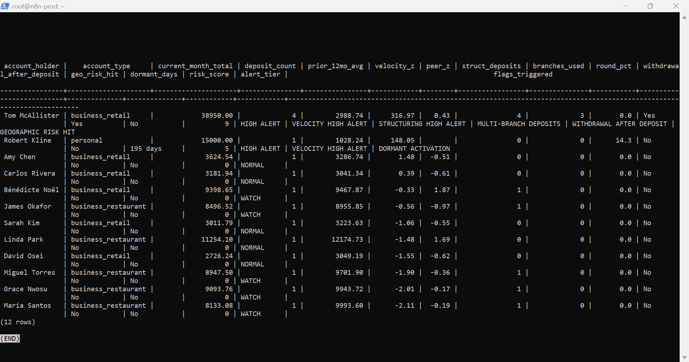
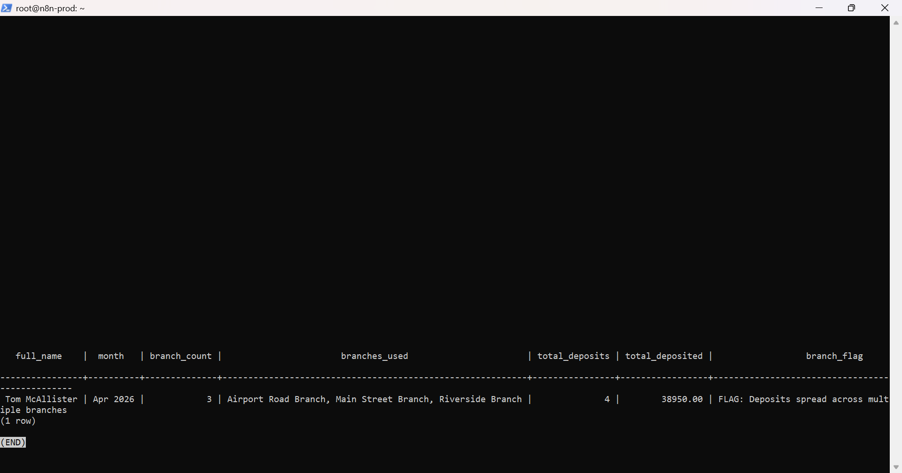
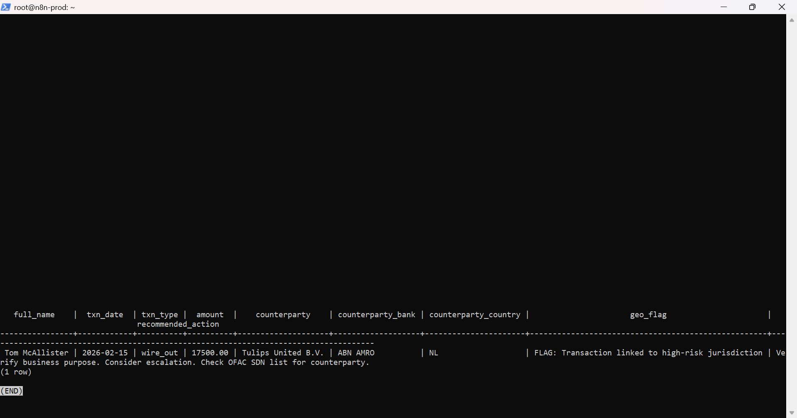
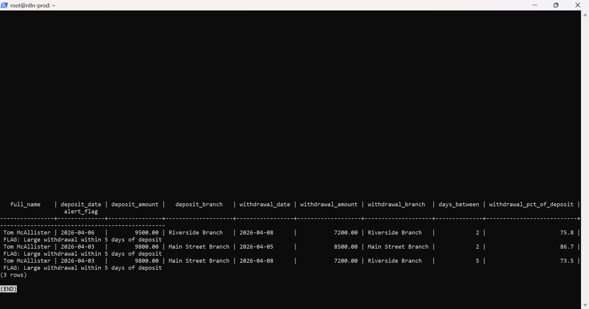
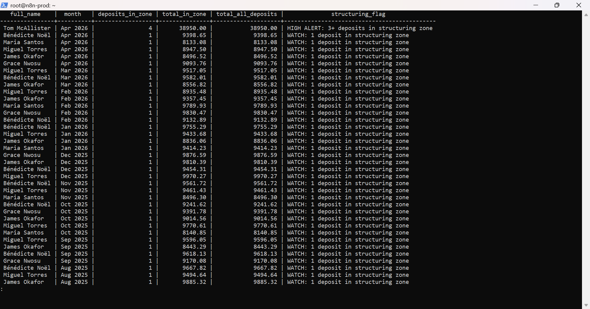
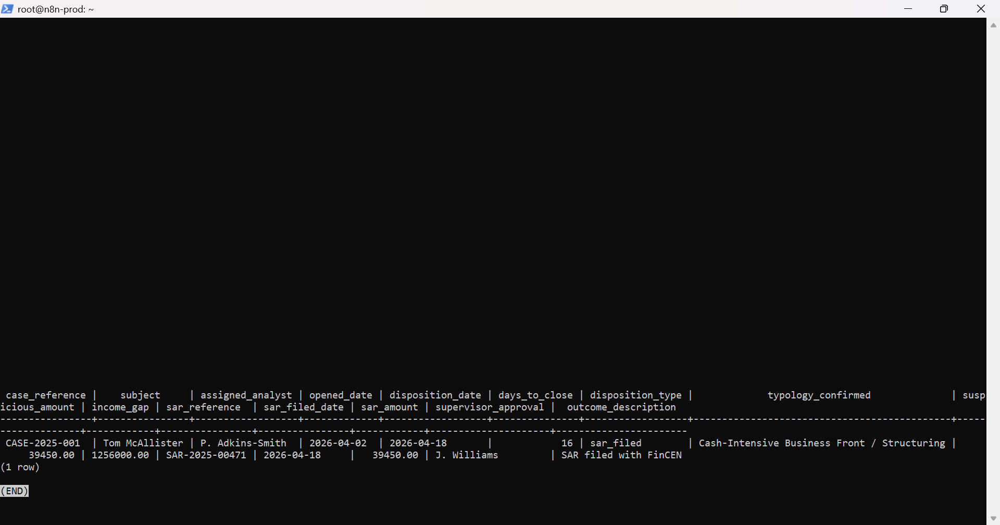
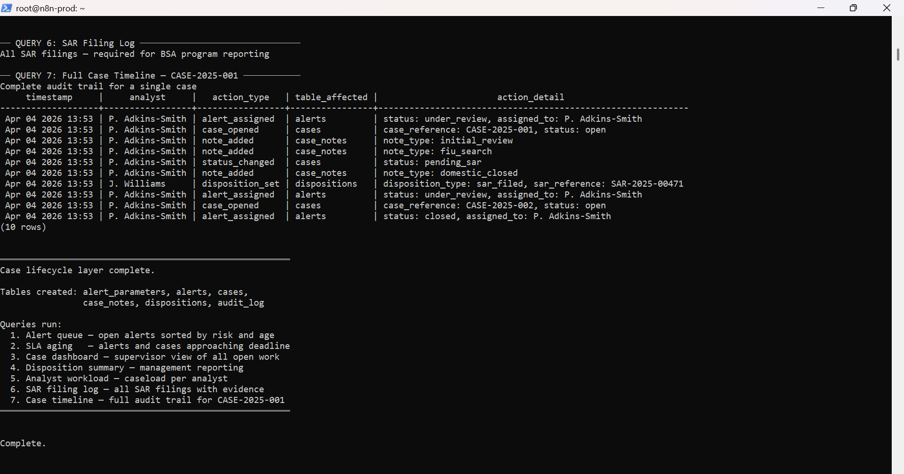

# AML Alert Engine

**Pam Adkins-Smith**
Financial Services Analyst | Transitioning into AML and Financial Crimes Analysis

[LinkedIn](https://linkedin.com/in/pam-adkins-smith) |
[GitHub](https://github.com/padkinssmith)

---

## Background

I have fifteen years of experience as an analyst and five years working
directly in financial services at E*TRADE, Morgan Stanley, and Osaic —
all regulated broker-dealers and investment platforms with active AML
compliance programs.

My investigative experience is real. At Red Ventures I identified a
coordinated internal fraud scheme involving 19 individuals — time theft
and commission fraud — escalated it through the appropriate channels,
and the investigation resulted in terminations. At Osaic, one of the
largest independent RIA networks in the US supporting over 10,000
advisors, I handle compliance-adjacent advisor support and flag activity
requiring further review.

I am now transitioning into AML and financial crimes analysis. I built
this project because I wanted to understand how transaction monitoring
actually works before sitting down to use it on the job — not just what
the alerts mean, but why they fire, what regulation requires them, and
what an analyst should be looking for when one does.

---

## What This System Does

It watches bank accounts for suspicious activity.

When something looks wrong it scores the account, generates an alert,
and tracks that alert through the full investigation process — from
the first flag all the way through to the final decision.

It covers the patterns analysts encounter most often in a cash
monitoring queue:

- A customer whose deposits suddenly spike far above their own history
- A business depositing far more cash than any similar business in the area
- Deposits made just under the $10,000 reporting limit, month after month
- The same account using different bank branches to make deposits
- Cash deposited then quickly withdrawn a few days later
- An account that sat dormant for months then suddenly became active
- Transactions connected to countries flagged as high risk

When multiple patterns fire on the same account at the same time,
the system combines them into a single risk score and surfaces that
account at the top of the alert queue.

---

## What Happens After the Alert Fires

Detection is only the first part of the job. This system also tracks
everything that comes after.

When an alert fires it is saved and assigned to an analyst. The analyst
opens an investigation, writes notes as they work through each source,
and records how their working theory changes as new evidence comes in.
At the end they record a final decision: clear it, monitor it, refer it,
or file a Suspicious Activity Report with FinCEN.

Every action taken is logged with a timestamp. The full history of every
case is preserved. Nothing disappears.

---

## Sample Output

The screenshots below are actual output from running this system.
No mock-ups. No editing.

**Combined Alert Dashboard — McAllister surfaces as HIGH ALERT**

The system correctly identified Tom McAllister with a risk score of 9,
firing on velocity, structuring, multi-branch deposits, withdrawal after
deposit, and geographic risk simultaneously.



**Multi-Branch Detection**

Four deposits spread across three different branches in a single month —
Airport Road Branch, Main Street Branch, and Riverside Branch.



**Geographic Risk**

Wire transfer to Tulips United B.V. via ABN AMRO flagged for high-risk
jurisdiction with a recommended action to verify business purpose and
check the OFAC SDN list.



**Withdrawal After Deposit**

Cash deposited then withdrawn within two days flagged as a layering
indicator. Three instances detected on the McAllister account.



**Structuring Detection**

McAllister's four current-month deposits all fall in the $8,000 to
$9,999 structuring zone, triggering a HIGH ALERT.



**SAR Filing — Disposition Summary**

CASE-2025-001 closed with a SAR filed with FinCEN. Income gap of
$1,256,000 documented. Supervised approved by J. Williams.



**Full Case Timeline — Audit Trail**

Complete chronological record of every action taken on the case,
from alert assignment through SAR filing.



---

## What This Says About Me as a Candidate

Building this system meant answering real questions. Why is the
structuring detection zone set at $8,000 and not $9,000? Why does
comparing an account to similar businesses catch things that comparing
it to its own history misses? Why does the audit log need a seven-year
retention period and what regulation requires it?

Every one of those decisions is documented in the code with its
regulatory basis.

I bring fifteen years of analytical experience, five years inside
regulated financial institutions, and real fraud investigation work
to this transition. This project is the technical foundation I built
on top of that.

---

## For Technical Reviewers

The SQL files contain the full detection logic, sample data with
suspicious patterns built in, and the complete case lifecycle layer.
Every query is commented in plain English explaining what it does
and why.

---

## What Is in the Repository

```
run_all.sql              — runs the entire system in one command
01_schema.sql            — the database structure
02_sample_data.sql       — sample accounts with patterns built in
03_detection_engine.sql  — 13 detection methods
04_alert_dashboard.sql   — combined alert queue output
05_case_lifecycle.sql    — alert tracking, cases, and dispositions
screenshots/             — actual output from running the system
```

---

## Running It

Requires PostgreSQL 13 or higher.

```bash
sudo -u postgres createdb aml_alert_engine
sudo -u postgres psql -d aml_alert_engine -f run_all.sql
```

---

## Author

**Pam Adkins-Smith**
Financial Services Analyst | Transitioning into AML and Financial Crimes Analysis
15 years analytical experience | 5 years financial services | E*TRADE | Morgan Stanley | Osaic

[LinkedIn](https://linkedin.com/in/pam-adkins-smith) |
[GitHub](https://github.com/padkinssmith)

Open to AML Analyst, BSA Analyst, Financial Crimes Analyst, and
Compliance Analyst roles. Remote preferred.
